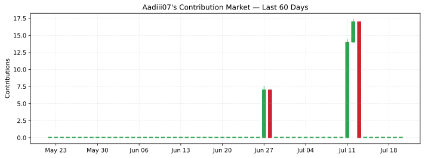

  

  

### 🚀 About Me

I'm Aditya — a developer driven by curiosity and ideas that tend to escalate. I build full-stack applications, experiment with AI and computer vision, and enjoy turning rough concepts into real, working systems. Always learning, building, and figuring out how far an idea can go.

- 🔭 I'm currently working on **an AI-powered real-time surveillance detection system.**
- 🌱 I'm currently learning **model training, cloud AI deployment, Spring Boot & computer vision.**
- 👯 I'm looking to collaborate on **AI, full-stack open-source projects with real-world impact, Java full-stack & AI-integrated solutions.**
- 🤔 I'm looking for help with **scaling real-time AI systems beyond the prototype and computer vision systems.**
- 💬 Ask me about **AI experiments, full-stack development & project ideas, Java, React, REST APIs & AI-integrated applications.**
- 😄 Pronouns: **he/him**

### 🛠 Tech Stack & Tools

**Languages**

  

**Frameworks & Libraries**

  

**Databases**

  

**Cloud & DevOps**

  

**Tools**

  

### 🤝 Connect With Me

  
  &nbsp;&nbsp;&nbsp;&nbsp;
  

### 📊 GitHub Stats

  

### 📈 Contribution Graph

  

## 📊 GitHub Stats

  

### 💬 Dev Quote

  

---

<i>⭐️ From <a href="https://github.com/Aadiii07">Aadiii07</a></i>

